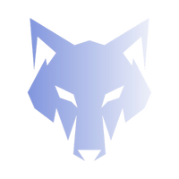

# Wobble - The Next-Gen Communication App

Wobble, Discord'a alternatif olarak geliştirilen, modern ve estetik bir iletişim platformudur. Daha hızlı, daha akıcı ve geliştirilebilir bir altyapı sunarak metin tabanlı iletişim için en iyi deneyimi hedefler.

## 🚀 Özellikler
- ✨ **Modern ve Şık Tasarım** - Kullanıcı dostu, temiz ve minimalist bir arayüz.
- 💬 **Gerçek Zamanlı Sohbet** - Düşük gecikmeli anlık mesajlaşma.
- 🏢 **Sunucu ve Kanal Sistemi** - Arkadaşların ve toplulukların organize olması için esnek yapı.
- 👥 **Gelişmiş Kullanıcı Profilleri** - Kendi avatarını ve biyografini özelleştir.
- 🔒 **Gizlilik ve Güvenlik** - Uçtan uca şifreleme ile güvenli iletişim.
- 🌟 **Yakında Gelecek!** - Rol sistemi, bot entegrasyonu, sesli ve görüntülü aramalar ve daha fazlası...

## ⚡ Kurulum
Wobble uygulamasını indirip hemen kullanmaya başlamak için aşağıdaki bağlantıyı ziyaret edebilirsin:

🔗 **[Wobble'ı İndir](https://wobble.tr/download/)**

## ✨ Lisans
Bu proje **MIT Lisansı** altında sunulmaktadır. Detaylar için [LICENSE](LICENSE) dosyasına göz atabilirsin.

---

**Wobble ile yepyeni bir iletişim deneyimine adım at!** ✨

